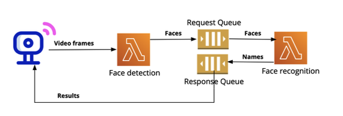

# CloudVision
Serverless Face‑Recognition Pipeline 
A fully event‑driven face‑recognition‑as‑a‑service that ingests video frames from IoT cameras, detects faces, and returns identities — all without managing servers.

🗺 <h2>Architecture</h2>
 

<h3>AWS Lambda (Docker/ECR)</h3>

face‑detection – HTTP POST via Function URL; runs MTCNN to crop faces.

face‑recognition – SQS‑triggered; uses InceptionResnetV1 (VGGFace2 weights) to embed & classify faces.

<h3>Amazon SQS</h3>

req-queue – detection ➜ recognition messages.

resp-queue – recognition results back to client.

Loose coupling & horizontal scaling come “for free”; average end‑to‑end latency ≤ 3 s for 100‑frame workload in us‑east‑1 (per course autograder).

🔧<h2>Key Features</h2> 

Pure PaaS: pay‑per‑request, no EC2.

Containerised Lambdas: shared image in Amazon ECR bundles PyTorch, facenet_pytorch, OpenCV, etc.

Cost‑aware: single 10 GB ECR repo (< $2/mo) plus AWS Free Tier compute fits class requirements. 
